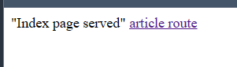
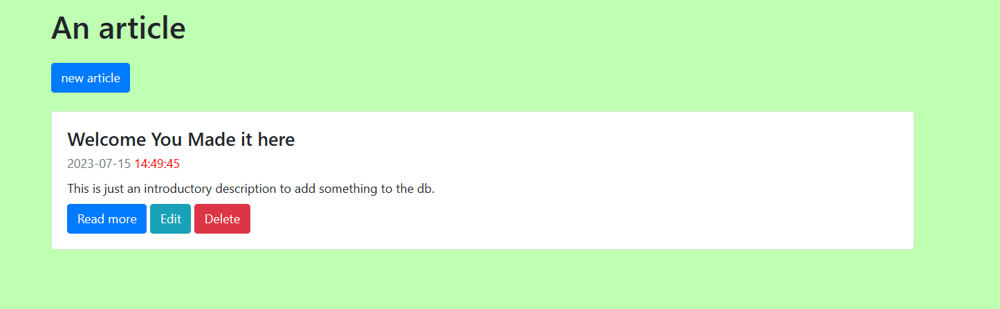

# The env variables

```
PORT=
SQLITE_DATABASE_PATH=
```

# To run

```
npm i
npm start
```

# To have an executable that runs the server/to be able to make it run on startup

```
echo "for windows:"
g++ file_site.cpp -o file_site.exe
file_site.exe
```

```
echo "for unix:"
g++ file_site.cpp -o file_site
./file_site
```

# The landing page is just a plain html, click on the link to the article page



# This is the article page


